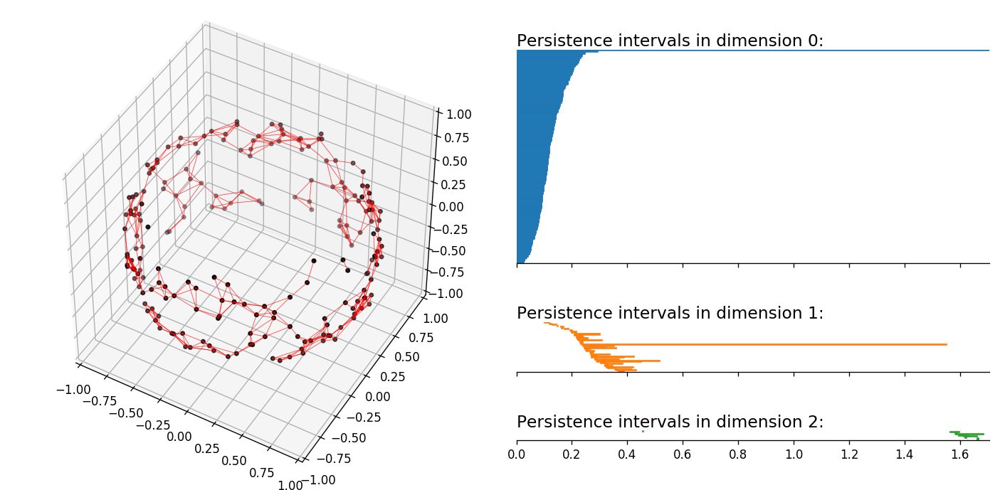

What is this?
---

This is a Python3 interface to [Ripser](https://github.com/Ripser/ripser), a fast software for 
for the computation of Vietoris–Rips persistence barcodes. This code is almost completely 
worthless unless you already have it installed.

Why do this?
---

Ripser is not multithreaded, as far as I can tell. For a particular project I'm working, 
barcodes over many realizations of probability densities ae needed. 
So, I'd like to parallelize it using the multiprocessing package.

That said, as of March 4, 2019 I notice that there is now a 
ripser python package on PyPI;

https://pypi.org/project/ripser/

Some investigation is needed to see if it's any better/worse 
compared to what we're doing in terms of speed, visualization, 
etc. Wouldn't be surprised if they did the "smart" thing and 
compiled the ripser code directly and interfaced in a better 
way instead of working with an external ripser binary.

Requirements
---

Python packages:
* numpy
* matplotlib
* scikit-learn
* multiprocessing, os, subprocess (these should be built in)

...and most importantly,
* The ripser executable, which is a C++ code and requires its own compiling.

How does it work?
---

Ripser takes in text files for input; preferably the lower triangle of a 
distance matrix in csv (comma seperated values) format. The output 
is to stdout (the terminal) listing out birth/death times for 
the PH dimensions you're interested in. It's the fastest 
tool out there (according to Wikipedia), but it's single threaded. 

This code is designed to accelerate this in the situation 
that you want to compute bar codes for *many* point clouds, by changing 
a few things in the standard pipeline of point-cloud to barcodes:
* Given a point cloud, use a scikit-learn function for fast calculation of 
the distance matrix (it also happens to be parallelized by default)
* Skip creating the file containing the distance matrix by instead 
pointing Ripser to the "file" in a location on memory (rule of thumb 
is that hard drive read/writes are slow)
* The output is parsed using regular expressions and stored 
in a dictionary format, with keys being dimensions; values being arrays 
containing the barcode intervals. 
* When you want to do many simulations of point clouds sampled from 
the same probability density, there are scripts here demonstrating 
how to parallelize this. In the future the interface might be further 
streamlined; where all one would need would be a function which 
samples from the distribution and a list of sample points to do.

Some other things in here...
---
* A few example scripts for point clouds sampled from various distributions
* A few example scripts for studying the results of a simulation which has 
been previously saved to file (the specific things plotted are specific to 
a project I'm working on)
* Options to save the raw input/output to ripser to text files if desired. Note 
there is nothing created on the hard drive by default.
* Functions to save the results of a large simulation to save to disk/load 
from disk the results from a simulation (using the Python pickle package)
* Function to save the results in HDF (Hierarchical Data Format) which 
can be accessed from Matlab if so desired (see the [matlab documentation](https://www.mathworks.com/help/matlab/ref/hdfread.html?s_tid=gn_loc_drop))
* Some rudimentary tools for plotting barcodes using the python 
package matplotlib

